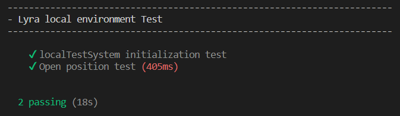
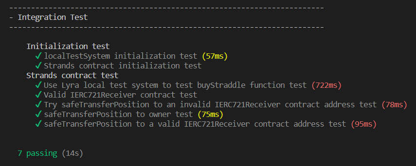

# Lyra Integration
##### Author: David Gimenez Gutierrez

This repository shows a possible integration with the DeFi protocol Lyra and it's part of the admission test for the position "Senior Smart Contract Developer at Strands"

### Main project information

#### Folders

* **contracts**
    Contains the 'Strands' contract used in the solution and two test contracts

* **test**
    Contains the test scripts to test the requested functionalities
    
    **Part 1**
    * Write a hardhat test script that deploys their local test system
    * Buy a call option
    
    **Part 2**
    * Wrote a smart contract with a buyStraddle function where you can input the size of the buy and strikeId. The function should take stable coin from the msg.sender and buy both a call and a put of that strikeId in an atomic transaction.

    **Part 3**
    * Add another test in your test script to use Lyra local test system to test your buyStraddle function

#### Files

* **contracts/Strands.sol**
    Contains the main solution code to implement Part 2 of the requested requirement.
    Include a description in the comments.

* **src/contracts/TestContract.sol** and **src/contracts/TestContract2.sol**
    These contracts are for testing purposes only

* **test/lyraLocalEnvironment.test.js**
    Contains the tests on the requested functionalities for Part 1.

* **test/strandsContract.test.js**
    Contains the tests on the requested functionalities for Parts 2 and 3.

### Used libraries

* @openzeppelin/contracts: ^4.9.3
* @lyrafinance/protocol: 0.1.5-alpha
* hardhat-dependency-compiler: 1.1.3
* ethereum-waffle: ^4.0.10
* chai: ^4.3.7,
* solc: 0.8.21

### Repository setup instructions

1. Install Visual Sutidio Code: https://code.visualstudio.com/

2. Install NodeJS that includes npm: https://nodejs.org/en/download/

3. Install Git that includes bash terminal: https://git-scm.com/download/win

4. **Recommended:** Set Git bush as you default terminal in VSCode
    * Open the command palette using Ctrl + Shift + P.
    * Type - Select Default Profile
    * Select Git Bash from the options

5. Install the following extensions in VSCode
    * Solidity - Nomic Foundation

7. Clone the repository in the local environment

8. Open project folder in VSCode

9. Install the project dependencies

### Test operations

**Part 1**

npx hardhat test test/lyraLocalEnvironment.test.js

**Part 2 and 3**

npx hardhat test test/strandsContract.test.js

